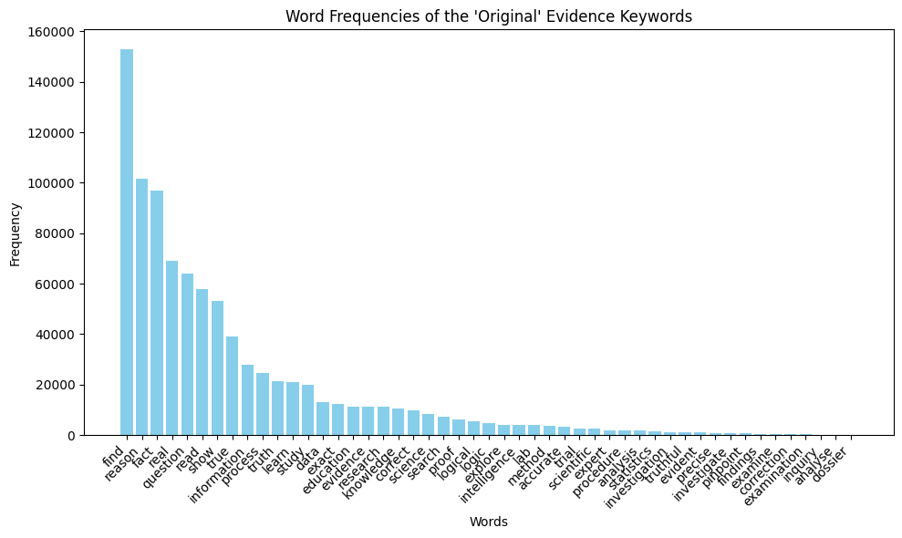

# XX

_Group members: Nina Geyer, Estelle Klevenz, Liane Strauch_

## Introduction

_Start off by setting the stage for your project. Give a brief overview of relevant studies or work that have tackled similar issues. Then, clearly describe the main question or problem your project is designed to solve._

How do you say it?
Recent studies in the realm of the political sciences have shown a shift in the rethoric of politicians. They propose that the current spread of misinformation in political discourse is linked to an "alternative understanding of truth and honesty that emphasizes invocation of subjective belief at the expense of reliance on evidence" [Source-2]. This can be seen and measured through the language that politicians use.
As social media is cited as a key medium for spreading misinformation [Source-2], it is interesting to have a look, not only *what* kind of information is spread, but also *how?*.

### Evidence minus Intuition (EMI)

To explore that we employ the EMI-Score. The Evidence-minus-Intuition measure was created in the context of US congressional speeches and the communication of politicians. It aims to capture how much of their language is "evidence-based" opposed to "intuition-based" to give insight into their approach to honesty and truthfulness [Source-1]. "Evidence-based" reasoning apporaches truth "by relying on evidence, facts, data and other elements of external reality" [Source-1] whereas the "intuition-based" approach relies "on feelings, instincts, personal values and other elements drawn mainly from a person’s internal experiences." in its conception of truth [Source-1]. 
The EMI is not concerned with the actual truth value of the content it is applied on but only considers the rhetoric. Therefore, we cannot infer anything about the actual quality of posts. But we assume that the concept can be transferred from political speech to the diverse content of Reddit forums - the social-media data to be analyzed - and can be employed to gain insight about the present language.

### Hypotheses

The data employed are Reddit posts from different subreddits, subforums on the platform. We expect some to have more evidence based language and other to rely more on intuition in how contents are discussed. More evidence-based language we expect in subreddits that explicitely have real-world facts as content, as news pages or "funfacts" people share. In our selection this would correspond to the r/worldnews, r/news, r/explainlikeimfive and r/todayilearned. We also expect evidence based communication in subreddits that have a defined topic that is supposed to be discussed seriously and or subreddits that explicitely focus on science, as in r/buildapc, r/technology and r/askscience.
Intuition-based language on the other hand we expect in subreddits that regard personal experience, like in r/relationships, r/offmychest, r/talesfromtechsupport and r/depression, and advice: r/relationship_advice, r/askmen, r/dating_advice, r/loseit, r/advice. 

Our research quest is to show that the EMI can be applied to the domain of social-media and to find out how language is used in different subreddits.

### Roadmap

After preprocessing we calculated the EMI score for subreddits, posts and individual words. To do this we followed the approach of the authors of the EMI score, as described in their paper from 2024 [Source-1]. The results were visually explored in histograms, wordclouds and PCA.

To validate our findings and test them for their robustness we conducted several "experiments" changing different settings of the approach. As a first experiment we compared the EMI scores for the long posts with those of the corresponding summaries. Secondly, we followed the process described by the authors and constructed and applied our own keyword list and thus a vocabulary definition of evidence resp. intuition based on the language used in the reddit forums. Lastly, we experimented with a different latent representation of the posts by applying BERT instead of the word2vec algorithm to the long posts.

## Dataset

_Provide a short description of the dataset used in your project. Focus on highlighting the aspects that are particularly relevant to your work._

The dataset contains Reddit subreddit posts containing "TL;DR" from 2006 to 2016. "TL;DR" is short for "too long, didn't read" and indicates a summary to a given post (either written by the author of the post or someone in the comments). The posts in the datasets are submissions and comments but only human produced, as bot-posts were filtered out. The original dataset contains 3,848,330 posts of 29'651 subreddits. For each posts the dataset has information on the author, the text body (raw and normalized), content, summary, subreddit and subreddit ID. The data is available on hugging face as hugging face dataset[Source-4].

The dataset was originally intended to train summary-prediciton but it is suitable for our task as well as working with "TL;DR" posts ensures a certain length of the posts which helps with consistent quality of the computed EMI scores and relativizes the influence of single words. 
The fact that bot posts were filtered is also important, as our analysis focuses on the language of humans in specific contexts.

To make the dataload manageable we filtered for the subreddits that contain more than 10'000 posts. We then did a manual selection of subreddits we expected to show either strong evidence-based language or intuition-based language. After an initial inspection we eliminated those, whose mean value of the EMI was closest to zero.

16 subreddits remained in our selection, which meant 615392 posts to analyze. The subreddits are: r/relationships,  r/relationship_advice,  r/explainlikeimfive, r/todayilearned, r/worldnews, r/offmychest, r/buildapc, r/askmen, r/technology, r/dating_advice, r/askscience, r/news, r/talesfromtechsupport, r/depression, r/loseit,
and r/advice.

Processing and analysis happened mostly on the content column and the summary, grouped by subreddit.

## Methods - Setup

XX - FR
_Outline the tools, software, and hardware environment, along with configurations used for conducting your experiments. Be sure to document the Python version and other dependencies clearly. Provide step-by-step instructions on how to recreate your environment, ensuring anyone can replicate your setup with ease:_

## Method - Experiments

_Report how you conducted the experiments. We suggest including detailed explanations of the preprocessing steps and model training in your project. For the preprocessing, describe  data cleaning, normalization, or transformation steps you applied to prepare the dataset, along with the reasons for choosing these methods. In the section on model training, explain the methodologies and algorithms you used, detail the parameter settings and training protocols, and describe any measures taken to ensure the validity of the models._

### Main Analysis - EMI
#### Preprocessing

On the selected subset of the reddit dataset we first applied data cleaning. We converted all words to lowercase, removed punctuation, tokenized the words with the nltk python package word-tokenizer and with the list provided by the nltk package we removed stopwords. The nltk tokenizer is a word tokenizer, currently an improved Treebank-Word-Tokenizer along with Punkt-Sentence-Tokenizer, we used the English version [SOURCE-3]. All preprocessing was applied on the "content" column, in batches of 1000 rows. All further analysis was done on the cleaned content.

#### EMI of the long posts

According to the paper, the EMI-procedure includes 1. creating a list of keywords for each of the concepts, 2. training a word2vec model on the cleaned tokens and those lists of keywords, 3. calculating the average vector for each of the keyword lists to have an abstract representation of the concepts, 4. then calculating the cosine similarity between this concept-representation vectors and each post, where for each post the average of the word embeddings for its content words is computed. 5. the cosine similarities are binned and normalized and finally the EMI is obtained by subtracting the intuition score form the evidence score.

We followed this approach and the means used by the original authors. For the main analysis we adopted the keyword lists that were used in [Source-1]. Then we used the word2vec algorithm from the Gensim library and trained 300-dimensional vectors based on a context window of 5 words, as Aroyehun et al. did. Next we applied mean pooling of the word embeddings for each post on the keyword lists and the tokenized posts and then computed the cosine similarity between the resulting post average vectors and the concept (evidence /intuition) vectors. We saved these values and further applied length-based binning to account for variations in the length of posts (binning similarities by length and subtracting the mean-similarity within each bin from the cosine simialrity of each instance, see [Source-1]). As a last step before computing the EMI by subtracting the intuition-score from the evidence-score, we z-transformed the cosine similarities (evidence-similarity and intuition-similarity) of each post to obtain those scores. 

If the resulting EMI score is now a positive value, it indicates that evidence-based language is prevalent in a given post, a negative value indicates prevalence of intuition-based rethoric.

### Extensions
#### EMI of the summaries

motivation: XX

To compute the EMI of the post summaries we applied the same cleaning as for the long posts on the summaries and the same computations. We saved the similarities and EMI score into the dataset for later analysis.

#### Tailored keyword lists

The keyword lists define the benchmark for each of the concepts. As the keyword lists used in the main analysis were originally developed in the context of political speech, the question occured, if their performance on social-media-language was equally good. To examine this, we analyzed what of the original vocabulary was actually used in the reddit posts and developed our own keyword lists based on the most common terms. In doing so, we again followed the approach of the developers of the original keyword lists.

  
  

The keyword approach of Lasser et al. involved: 1. starting out with a set of initial keywords, 2. expaning them computationally using fasttext embeddings and colexification networks, 3. filtering for duplicates, overlapping terms (in both lists) and lemma inflections. Subsequently, they validated their keyword lists through an online survey where paricipants rated the terms in how the represent the concpets and used a t-test to examine the results. We adapted their approach but waived the validation.

As initial keywords we used those of the original keywords used in the main analysis that had a word count of over 1000 in our data. The frequency charts can be seen in Figure 1. We manually excluded "true" from the evidence seed-list and "wrong" from the intuition list to remove initial bias. we also removed "find" from the evidence list, as the termn is ambiguous, with different meanings in different contexts (E: "The study finds..." / I: "I find it to be challenging..."). we added to the evidence list the terms "article" and "argument" as we expect them to be prevalent in contexts such as: "This article shows..." and "An argument against this.." both showing evidence based language.

We expaned this list using a pretrained embedding model, the English fastText word vectors trained on Common Crawl (subword-aware, 300d). The subword modeling makes it well suited for informal language, as can be present on social media. The fasttext model vectors were then translated to Gensim KeyedVectors format for easy handling. We expanded using the top 10'000 neighbors and filtered those with a cosine simialrity greater than / equal to 0.75.
As an interim step we cleaned the retrieved set from misspellings and lemma inflections.

For colexifications we employed the Database of Cross-Linguistic Colexifications [Source-5]. As there is currently no API to their concept database available, we manually retrieved related concepts via the web interface. Further we removed the intersection between the evidence and intuition list and manually excluded the terms that were not satisfactory associated with the pursued definiton of evidence and intuition.

We then ran again the main analysis with the new keyword lists. Expect for exchanging the lists, all other steps of analysis stayed identical. The new keyword lists were applied on the long posts, thus on the cleaned content feature.

#### BERT XX
   
3. different model (BERT)
motivation:

embeddings rausgeholt, CLS
512 Tokens pro input
die meisten Posts zu gross fürs BERT

Posts in sätze unterbrechen
von jedem satz CLS
mean über Posts

- graue embedding mit PCA gezeigt
- ev und int als vektor
- sätze statt wörter als dict
	- better for contextualization
- durch bert
- pCA
- normalisiert
- correlation with regular

## Results and Discussion XX
_Present the findings from your experiments, supported by visual or statistical evidence. Discuss how these results address your main research question._

  

We created binned histograms of the distribution of EMI scores of the posts over a sub, colored according to whether their mean is a positive score (green) or a negative score (purple). We can tell that 10/16 subs tend to have more evidence-based language whereas 6/10 lean more towards intuition-based rethoric. With exception of r/talesfromtechsupport, most of the distribution are right-skewed.
The EMI ranges from -2 to 8, having a wider range of values on the positive side. Of particular note is r/advice, the only distribution where there is a sign change between mean and mode. For the other subs, color and mean correspond in the sign of the EMI scores. Advice is colored green, with a slightly positive mean, but the mode is on the intuitive side.

  

To gain insight into the language used in the subs, we plotted the most used words and their individual EMI score. The darker the color the closer the word is to either the evidence or the intuition benchmark. It is interesting that whereas most of the subs show generic words like "people", "like", "would, "im" (two examples shown on the left side of Figure XX), some subs have more tailored language, which even shows in the most occuring terms, this holds for r/loseit, a sub about weight-loss, where "weight" indeed is the most occuring term and r/talesformtechsupport that shows different vocabular with "back", "one", "get" and "work". 

  

  
  

- PCA
    - subreddit vector representation

works generally

comparison long vs. short
- histogram comparison
- what is interesting?

To explore the calculated results we created binned histograms of the distribution of EMI scores of the posts over a subreddit, colored according to whether their mean is a positive score (green) or a negative score (purple). We then created wordclouds that show the top occuring words per subreddit, colored accordingly to the EMI of the single term.

### Main Analysis
- kinda works
### Long post vs. Summary
### Original vs. Customized Keyword Lists
- intuition lists tend to have negative connotations ("wrong" ,"dishonest")
- not intented to judge content
- interesting: talesfromtechsupport very evidency
- advice has an evidence mean but intuition mode

### Word2Evc vs. BERT

- interesting: talesfromtechsupport very evidency
- advice has an evidence mean but intuition mode

##### thoughts xx
- does it mirror the cliff between social and natural sciences?
- limit in preprocessing/approach
    Is the Preprocessing valid (how does it change the result?)
    Stopword debate
    Loss of words through spelling mistakes (spelling in itself might be a predictor)

- REMINDER: only analyses rhetoric and it can only be speculated to which extent it is a statement about the actual methods and rigor to the claims of the postee.
(marker words possibly change over time - longevity of the dictionary)
- next steps: Comparison social science paper and computer science / chemistry technical papers
Keywords
- intuition tied to negative in language - in original keywords_ "fake", "wrong" - how are those intuitive more than evidency words? gives intuition bad light
The provided dictionary is specialized to political talk (vs general online dialogue in reddit)
adapted keyword list not differing significantly though

## Conclusion XX

_Summarize the major outcomes of your project, reflect on the research findings, and clearly state the conclusions you've drawn from the study._

## Contributions

| Team Member      | Contributions                                             |
|------------------|-----------------------------------------------------------|
| Nina Geyer       | main word2vec preprocessing & analysis, visualizations    |
| Estelle Klevenz  | dictionary experiments, webpage                           |
| Liane Strauch    | model experiments (BERT), theory, slides                  |

## References

_Include a list of academic and professional sources you cited in your report, using an appropriate citation format to ensure clarity and proper attribution._

[Computational analysis of US congressional speeches reveals a shift from evidence to intuition](https://doi.org/10.1038/s41562-025-02136-2) (EMI-paper) [Source-1]

[From alternative conceptions of honesty to alternative facts in communications by US politicians](https://doi.org/10.1038/s41562-023-01691-w) [Source-2]

https://www.nltk.org/api/nltk.tokenize.word_tokenize.html [Source-3]

[huggingface Data](https://huggingface.co/datasets/webis/tldr-17/viewer/default) [Source-4]

[CLICS3](https://clics.clld.org/parameters) [Source-5]
