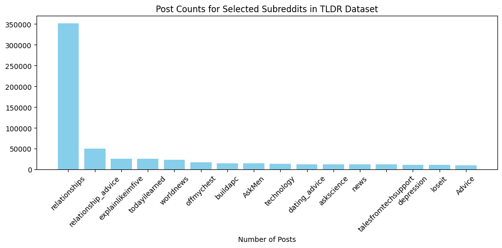

# "Trust me, Bro": A Reddit Rhetoric Study
_by Cicero's analysts: Nina Geyer, Estelle Klevenz, Liane Strauch_

at last:
XX - sources
XX - figures

## Introduction

How do you say it?
Recent studies in the realm of the political sciences have shown a shift in the rethoric of politicians. They propose that the current spread of misinformation in political discourse is linked to an "alternative understanding of truth and honesty that emphasizes invocation of subjective belief at the expense of reliance on evidence" [Source-2]. This can be seen and measured through the language that politicians use.
As social media is cited as a key medium for spreading misinformation [Source-2], it is interesting to have a look, not only *what* kind of information is spread, but also *how*. 

### Evidence minus Intuition (EMI)

To explore this we employ the EMI-Score. The Evidence-minus-Intuition measure was created in the context of US congressional speeches and the communication of politicians. It aims to capture how much of their language is "evidence-based" opposed to "intuition-based" to give insight into their approach to honesty and truthfulness [Source-1]. "Evidence-based" reasoning apporaches truth "by relying on evidence, facts, data and other elements of external reality" [Source-1] whereas the "intuition-based" approach relies "on feelings, instincts, personal values and other elements drawn mainly from a person’s internal experiences" in its conception of truth [Source-1]. 
The EMI is not concerned with the actual truth value of the content it is applied on but only considers the rhetoric. Therefore, we cannot infer anything about the actual quality of posts. But we assume that the concept can be transferred from political speech to the diverse content of Reddit forums - the social-media data to be analyzed - and can be employed to gain insight about the present language.

### Hypotheses

The data used are long Reddit posts from different subreddits, subforums on the platform. We expect some to have more evidence based language and other to rely more on intuition in how topics are discussed. More evidence-based language we expect in subreddits that explicitely have real-world facts as content, as news pages or "funfacts" people share. In our selection this would correspond to the r/worldnews, r/news, r/explainlikeimfive and r/todayilearned. We also expect evidence based communication in subreddits that have a defined topic that is supposed to be discussed seriously and or subreddits that explicitely focus on science, as in r/buildapc, r/technology and r/askscience.
Intuition-based language on the other hand we expect in subreddits that regard personal experience, like in r/relationships, r/offmychest, r/talesfromtechsupport and r/depression, and advice: r/relationship_advice, r/askmen, r/dating_advice, r/loseit, r/advice. 

Our research quest is to show that the EMI can be applied to the domain of social-media and to find out how language is used in different subreddits.

### Roadmap

After preprocessing we calculated the EMI score for subreddits, posts and individual words. To do this we followed the approach of the authors of the EMI score, as described in their paper from 2024 [Source-1]. The results were visually explored in histograms, wordclouds and PCA.

To validate our findings and test them for their robustness we conducted several "experiments" changing different settings of the approach. As a first experiment we compared the EMI scores for the long posts with those of the corresponding summaries. Secondly, we followed the process described by the authors and constructed and applied our own keyword list and thus a vocabulary definition of evidence resp. intuition based on the language used in the reddit forums. Lastly, we experimented with a different latent representation of the posts by applying BERT instead of the word2vec algorithm to the long posts.

## Dataset

The dataset contains Reddit subreddit posts containing "TL;DR" from 2006 to 2016. "TL;DR" is short for "too long, didn't read" and indicates a summary to a given post (either written by the author of the post or someone in the comments). The posts in the datasets are submissions and comments but only human produced, as bot-posts were filtered out. The original dataset contains 3,848,330 posts of 29'651 subreddits. For each posts the dataset has information on the author, the text body (raw and normalized), content, summary, subreddit and subreddit ID. The data is available on hugging face as hugging face dataset[Source-4].

The dataset was originally intended to train summary-prediciton but it is suitable for our task as well as working with "TL;DR" posts ensures a certain length of the posts which helps with consistent quality of the computed EMI scores and relativizes the influence of single words. 
The fact that bot posts were filtered is also important, as our analysis focuses on the language of humans in specific contexts.

To make the dataload manageable we filtered for the subreddits that contain more than 10'000 posts. We then did a manual selection of subreddits we expected to show either strong evidence-based language or intuition-based language. After an initial inspection we eliminated those, whose mean value of the EMI was closest to zero.

16 subreddits remained in our selection, which meant 615'392 posts to analyze. The subreddits and their prevalence in the dataset can be seen in Figure 1.

<figure float="left">

<figcaption>Figure 1 - Caption goes here</figcaption>
</figure>

Processing and analysis happened mostly on the content column and the summary, grouped by subreddit.

## Methods - Setup

All analysis was done using Pythona and Python libraries. Our code ran with a Python 3.9.21 kernel in its own conda environment. To replicate our analysis we provide the requirements.txt to replicate the environment. All code-files can be found on our Github under "code". Consult the README in the code directory for details on the script management and usage.
Tools that were used in addition to Python libraries were the CLICS3 web interface for colexifications (see the subsection "Tailored keyword lists") and ChatGPT for the generation of keyphrases (see the subsection "BERT XX")

## Method - Experiments
### Main Analysis - EMI
#### Preprocessing

On the selected subset of the reddit dataset we first applied data cleaning. We converted all words to lowercase, removed punctuation, tokenized the words with the nltk python package word-tokenizer and with the list provided by the nltk package we removed stopwords. The nltk tokenizer is a word tokenizer, currently an improved Treebank-Word-Tokenizer along with Punkt-Sentence-Tokenizer, we used the English version [SOURCE-3]. All preprocessing was applied on the "content" column, in batches of 1000 rows. All further analysis was done on the cleaned content.

#### EMI of the long posts

According to the paper, the EMI-procedure includes (1.) creating a list of keywords for each of the concepts, (2.) training a word2vec model on the cleaned tokens and those lists of keywords, (3.) calculating the average vector for each of the keyword lists to have an abstract representation of the concepts, (4.) then calculating the cosine similarity between this concept-representation vectors and each post, where for each post the average of the word embeddings for its content words is computed. (5.) the cosine similarities are binned and normalized and finally (6.) the EMI is obtained by subtracting the intuition score form the evidence score.

We followed this approach and the means used by the original authors. For the main analysis we adopted the keyword lists that were used in [Source-1]. Then we used the word2vec algorithm from the Gensim library and trained 300-dimensional vectors based on a context window of 5 words, as Aroyehun et al. did. Next we applied mean pooling of the word embeddings for each post on the keyword lists and the tokenized posts and then computed the cosine similarity between the resulting post average vectors and the concept (evidence /intuition) vectors. We saved these values and further applied length-based binning to account for variations in the length of posts (binning similarities by length and subtracting the mean-similarity within each bin from the cosine simialrity of each instance, see [Source-1]). As a last step before computing the EMI by subtracting the intuition-score from the evidence-score, we z-transformed the cosine similarities (evidence-similarity and intuition-similarity) of each post to obtain those scores. 

If the resulting EMI score is now a positive value, it indicates that evidence-based language is prevalent in a given post, a negative value indicates prevalence of intuition-based rethoric.

### Extensions
#### EMI of the summaries

As proposed in the introduction we expect the EMI to work much better on long posts than on short ones. To check if this assumption holds for our data we employ the provided summaries to the posts and run the EMI score computation on them as well.

To compute the EMI of the post summaries we applied the same cleaning as for the long posts on the summaries and the same computations. We saved the similarities and EMI score into the dataset for later analysis.

#### Tailored keyword lists

The keyword lists define the benchmark for each of the concepts. As the keyword lists used in the main analysis were originally developed in the context of political speech, the question occured, if their performance on social-media-language was equally good. To examine this, we analyzed what of the original vocabulary was actually used in the reddit posts and developed our own keyword lists based on the most common terms. In doing so, we again followed the approach of the developers of the original keyword lists. They themselves followed the apporach of an earlier publication which we adapted [Source-1].

<figure float="left">

  
  

<figcaption>Figure XX - Caption goes here</figcaption>
</figure>

The keyword approach of Lasser et al. involved: (1.) starting out with a set of initial keywords, (2.) expaning them computationally using fasttext embeddings and colexification networks, (3.) filtering for duplicates, overlapping terms (in both lists) and lemma inflections [Source-2]. Subsequently, they validated their keyword lists through an online survey where paricipants rated the terms in how the represent the concpets and used a t-test to examine the results. We adapted their approach but waived the validation.

As initial keywords we used those of the original keywords used in the main analysis that had a word count of over 1000 in our data. The frequency charts can be seen in Figure 1. We manually excluded "true" from the evidence seed-list and "wrong" from the intuition list to remove initial bias. we also removed "find" from the evidence list, as the termn is ambiguous, with different meanings in different contexts (E: "The study finds..." / I: "I find it to be challenging..."). we added to the evidence list the terms "article" and "argument" as we expect them to be prevalent in contexts such as: "This article shows..." and "An argument against this.." both showing evidence based language.

We expaned this list using a pretrained embedding model, the English fastText word vectors trained on Common Crawl (subword-aware, 300d). The subword modeling makes it well suited for informal language, as can be present on social media. The fasttext model vectors were then translated to Gensim KeyedVectors format for easy handling. We expanded using the top 10'000 neighbors and filtered those with a cosine simialrity greater than / equal to 0.75.
As an interim step we cleaned the retrieved set from misspellings and lemma inflections.

For colexifications we employed the Database of Cross-Linguistic Colexifications [Source-5]. As there is currently no API to their concept database available, we manually retrieved related concepts via the web interface [Link]. Further we removed the intersection between the evidence and intuition list and manually excluded the terms that were not satisfactory associated with the pursued definiton of evidence and intuition.

We then ran again the main analysis with the new keyword lists. Except for exchanging the lists, all other steps of analysis stayed identical. The new keyword lists were applied on the long posts, thus on the cleaned content feature.

#### BERT XX
   
3. different model (BERT)
motivation:
- static vs contextualized
  - allgemeine klausurantwort warum context besser
 cls embeddings erklären

embeddings rausgeholt, CLS
512 Tokens pro input
die meisten Posts zu gross fürs BERT

Posts in sätze unterbrechen
von jedem satz CLS
mean über Posts

- graue embedding mit PCA gezeigt
- ev und int als vektor
- sätze statt wörter als dict
	- better for contextualization
- durch bert
- PCA
- normalisiert
- correlation with regular

## Results

<figure float="left">
  
<figcaption>Figure XX - Caption goes here</figcaption>
</figure>

We created binned histograms of the distribution of EMI scores of the posts over a sub, colored according to whether their mean is a positive score (green) or a negative score (purple). We can tell that 10/16 subreddits tend to have more evidence-based language whereas 6/10 lean more towards intuition-based rethoric. With exception of r/talesfromtechsupport, most of the distribution are right-skewed.
The EMI ranges from -2 to 8, having a wider range of values on the positive side. Of particular note is r/advice, the only distribution where there is a sign change between mean and mode. For the other subreddits, color and mean correspond in the sign of the EMI scores. Advice is colored green, with a slightly positive mean, but the mode is on the intuitive side.

<figure float="center">
  
<figcaption>Figure XX - Caption goes here</figcaption>
</figure>

To gain insight into the language used in the subreddits, we plotted the most used words and their individual EMI score. The darker the color the closer the word is to either the evidence or the intuition benchmark. It is interesting that whereas most of the subreddits show generic words like "people", "like", "would, "im" (two examples shown in Figure XX A), some subreddits have more tailored language, which even shows in the most occuring terms, this holds for r/loseit, a sub about weight-loss, where "weight" indeed is the most occuring term and r/talesformtechsupport that shows different vocabular with "back", "one", "get" and "work". 

<figure float="center">
  
<figcaption>Figure XX - Caption goes here</figcaption>
</figure>

The PCA of each sub's average vector and the concept vectors shows in simplified form the spatial relationship between the subreddits and the concepts. As in the histograms, advice though colored green shows more similarity (=smaller distance) to the intuition subreddits than the other evidence subreddits. r/losit also strikes with a bigger gap to the other evidence subreddits. Apart from that the general classification seems to work, as you can lay a hyperplane through the space and separate the two groups along the "EMI of 0".

XX - all emi figure

### Long post vs. Summary

As shown in Figure XX, there are notable differences between long and short posts regarding their EMI scores. For most evidence-based subreddits, long posts tend to be more evidence-based than their respective summaries. The distribution of EMI scores is broader for summaries than for long posts, indicating a greater variability in summaries. These differences are substantial and not just random fluctuations — the correlation between long posts and summary EMI scores is weak or non-existent (see Figure XX), underlining the difference between the two formats.

<figure float="left">

  
  

<figcaption>Figure XX - Caption goes here</figcaption>
</figure>

### Original vs. Customized Keyword Lists
The influence of the new keyword lists on the EMI in comparison to the original ones can be seen in Figure XX. As one can see the deviation is minimal, with a global correlation of XX between the scores (see Figure XX). All subreddits get classified into the same category as before, even though the concept definiton is adjusted. This can also be seen in the corresponding PCA, see Figure XX.

<figure float="left">
  
<figcaption>Figure XX - Caption goes here</figcaption>
</figure>

### Word2Evc vs. BERT

XX - Liane
- es ist weird

## Discussion

The results show that our approach to answer the proposed research quest generally worked quite well. The transfer of the EMI to reddit data succeeded. How the subreddits behave linguistically compared to our expectations is interesting (see Table 1). 13 out of 16 of our expectations were confirmed by the main model. The results deviated for r/Advice, r/loseit and r/talesfromtechsupport, where we guessed intuition. Even though the subreddits discuss personal experiences and advice, they seem to do so in a way, our models detect as evidence-based. Especially for r/talesfromtechsupport this is interesting, as the title of the subreddit already gives away, that there is no "fact-claim" in this subreddit, and we would expect stories that do not have a particular "evidence-based" focus in their language.

<table border="1">
  <thead>
    <tr>
      <th>subreddit</th>
      <th>emi</th>
      <th>emi_short</th>
      <th>emi_dict</th>
      <th>emi_bert</th>
      <th>expectation</th>
      <th>guess</th>
    </tr>
  </thead>
  <tbody>
    <tr><td>Advice</td><td>0.339718</td><td>0.006631</td><td>0.333999</td><td>-0.092573</td><td>intuition</td><td>False</td></tr>
    <tr><td>AskMen</td><td>-0.330552</td><td>-0.330662</td><td>-0.333857</td><td>-0.226084</td><td>intuition</td><td>True</td></tr>
    <tr><td>askscience</td><td>1.753339</td><td>0.692008</td><td>1.769951</td><td>0.343264</td><td>evidence</td><td>True</td></tr>
    <tr><td>buildapc</td><td>1.961137</td><td>1.293441</td><td>1.965890</td><td>0.232905</td><td>evidence</td><td>True</td></tr>
    <tr><td>dating_advice</td><td>-0.324222</td><td>-0.270277</td><td>-0.346307</td><td>-0.172131</td><td>intuition</td><td>True</td></tr>
    <tr><td>depression</td><td>-0.267058</td><td>0.149373</td><td>-0.268941</td><td>-0.260357</td><td>intuition</td><td>True</td></tr>
    <tr><td>explainlikeimfive</td><td>1.327834</td><td>0.396334</td><td>1.354175</td><td>0.205109</td><td>evidence</td><td>True</td></tr>
    <tr><td>loseit</td><td>0.502032</td><td>0.616786</td><td>0.520622</td><td>0.030121</td><td>intuition</td><td>False</td></tr>
    <tr><td>news</td><td>0.950472</td><td>0.152814</td><td>0.974475</td><td>0.103567</td><td>evidence</td><td>True</td></tr>
    <tr><td>offmychest</td><td>-0.167925</td><td>-0.067313</td><td>-0.173061</td><td>-0.190736</td><td>intuition</td><td>True</td></tr>
    <tr><td>relationship_advice</td><td>-0.467262</td><td>-0.211178</td><td>-0.473538</td><td>-0.176722</td><td>intuition</td><td>True</td></tr>
    <tr><td>relationships</td><td>-0.437910</td><td>-0.151362</td><td>-0.442456</td><td>-0.186816</td><td>intuition</td><td>True</td></tr>
    <tr><td>talesfromtechsupport</td><td>2.287213</td><td>1.018076</td><td>2.267735</td><td>0.231347</td><td>intuition</td><td>False</td></tr>
    <tr><td>technology</td><td>1.550219</td><td>0.488868</td><td>1.568976</td><td>0.153894</td><td>evidence</td><td>True</td></tr>
    <tr><td>todayilearned</td><td>0.845624</td><td>0.191401</td><td>0.863641</td><td>0.076525</td><td>evidence</td><td>True</td></tr>
    <tr><td>worldnews</td><td>0.882169</td><td>0.118915</td><td>0.904538</td><td>0.121513</td><td>evidence</td><td>True</td></tr>
  </tbody>
</table>

Within the results of our models it is noteworthy, that they mostly give the same language-indication. The goal of the different experiments was to test the robustness of the score. This assessment is therefore positive.

Since language is all about the details, when reflecting on the entire approach, the preprocessing, the editing of the language, must be evaluated. One limitation we find in our approach is that the selection of excluded stop words could have influenced the embeddingsW we did a crosschecking with not removing the words, which did not make a big difference on the sample tested, but we did not check with different sets of stopwords. 
Another one is that misspelled versions of words have been excluded from the keyword lists. This seems appropriate for official political speeches. For the application to social media data, however, the question arises as to whether “typos” are not much more part of authentic content and should therefore have been taken into account when classifying the posts against the concepts.

### Long post vs. Summary

For the EMI scores on the summaries we found values that are significantly deviating from the base EMI score we obtained. This can be explained as firstly, the shorter the post, the weightier the words, therefore the more unstable and fluctuating are the scores. Secondly, a summary does not have to be written with the same attitude as the long post. It is often written with another intention than being a neutral summary and therefore has a different rhetoric. Especially after a long and content-wise potentially serious post, a summary could be phrased more unserious. Or the other way around: a detailed personal experience is summarised with a pointed fact.
This could exlain how for r/depression the EMI on the summaries gives a slightly positive averaged EMI score, whereas the main EMI score is on the negative side.

### Original vs. Customized Keyword Lists

The high correlation between the EMI scores calculated with respect to the original keyword-lists and the EMI scores based on the adapted concept definitions shows a high robustness of the concept capture. 
To us it was important to clean the intuition lists of negative connotations (with terms such as "wrong" ,"dishonest") as intuition is not meant to be negatively judged and the measure is not intended to judge the content of a post. This adaption did not affect the result significantly.

We see a high transferability, even with keywords that are not matching the language used in social media. The provided dictionary is specialized to political talk (with terms such as "investigate", "dossier", "inquiry") but works well even on general online dialogue. The two approaches to honesty and truthfulness, proposed for political communication [Source-1] are, based on our findings, not constrained to the domain but can be found in general speech. The EMI score is well generalizable, accoring to our results.

### Word2Evc vs. BERT

As contextualized embeddings can capture more nuances and layers of meaning we were interested, how well our approach would work employing BERT for the embeddings. To learn this mentioned context, BERT required sentences that represented the concepts, more than just keyword lists. One limitation of our approach, and possible explanation for the big diffrence in performance on the data, is that we did miss to test several different ways of providing concept-context for the model.

We kept the initial approach, where we prompted ChatGPT to give a sentence to each keyword. It would have been interesting to compare this to the raw keyword lists, and customised sentences that are a) simpler and b) more complex than the ones ChatGPT provided us with. We could have validated them within the team and could have had them run on a small sample of the BERT model to see their influence on the embeddings. Instead we have only pursued one approach and see that it has not been effective.

Another possibility to improve the BERT model on our data woudl have been to finetune it. We chose to apply it out of the box which might have been inadequate for our case.

Overall it has to be noted that the comparability between the BERT EMI-scores and the other results is limited thorugh several factors: First BERT requried a different preprocessing with its own interal tokenization, we then used different keyphrases and finally we could run BERT only on a sample of 222'600 of 615'392 posts as the computational resources needed for the whole dataset exceeded our means.

## Conclusion

Looking on our results we again want to remind, that our analyses only inspected language, not content. We only analysed rhetoric and it can only be speculated to which extent it is a statement about the actual methods and rigor to the claims of the postee.

To undermine this: We inspected which phrases got the highest evidence score with BERT (?XX). Among the top 10 was the following post:

The post shows s a clear attitude of speculation and conspiracy - still it is ranked in our top of "fact-based" *language*. 

Overall we are happy with how the EMI applied to reddit posts. It shows generalizability beyond the political domain and robustness in its definition of concepts.

The latent construct we aimed to measure with the EMI is different approaches to truth. However, we ask ourselves whether - with the given approach - it is not rather the confidence / absoluteness of the language used that is being measured. This naturally has a high correlation with the pursued understandings of truth: Someone who refers to certain facts can speak with more conviction than someone who holds their own opinion. However, especially in times of misinformation and deliberate disinformation, it is precisely the impression of conviction without the backup of scientific facts that is used to influence opinion. 

What we also conclude from this assumption is that there are domains that are inevitably categorized differently due to their content and how much uncertainty their content contains. In computer science, existing questions can be discussed with much more precision and insistence, whereas the subject matter of psychology, for example, requires that findings be explicitly relativized.

Accordingly, an interesting next step would be to apply the EMI score to social science and natural science/computer science articles in order to examine these assumptions and hypotheses in detail.

## Contributions

| Team Member      | Contributions                                             |
|------------------|-----------------------------------------------------------|
| Nina Geyer       | main word2vec preprocessing & analysis, visualizations    |
| Estelle Klevenz  | dictionary experiment, webpage                            |
| Liane Strauch    | model experiment (BERT), slides                           |

## References

_Include a list of academic and professional sources you cited in your report, using an appropriate citation format to ensure clarity and proper attribution._

[Computational analysis of US congressional speeches reveals a shift from evidence to intuition](https://doi.org/10.1038/s41562-025-02136-2) (EMI-paper) [Source-1]

[From alternative conceptions of honesty to alternative facts in communications by US politicians](https://doi.org/10.1038/s41562-023-01691-w) [Source-2]

https://www.nltk.org/api/nltk.tokenize.word_tokenize.html [Source-3]

[huggingface Data](https://huggingface.co/datasets/webis/tldr-17/viewer/default) [Source-4]

[CLICS3](https://clics.clld.org/parameters) [Source-5]

style="color: green;"
## Appendix
<figure>
<table border="1">
  <thead>
    <tr>
      <th>Evidence</th>
      <th>Intuition</th>
    </tr>
  </thead>
  <tbody>
    <tr><td>accurate</td><td>advice</td></tr>
    <tr><td style="color: green;">admit</td><td><s>belief</s></td></tr>
    <tr><td style="color: red;"><s>analyse</s></td></td><td>believe</td></tr>
    <tr><td>analysis</td><td><s>bogus</s></td></tr>
    <tr><td><b>announce</b></td><td style="color: red;"><s>common sense</s></td></tr>
    <tr><td><b>argument</b></td><td><b>conceive</b></td></tr>
    <tr><td><b>article</b></td><td><s>deceive</s></td></tr>
    <tr><td><b>calculate</b></td><td><s>deception</s></td></tr>
    <tr><td><b>certain</b></td><td><s>dishonest</s></td></tr>
    <tr><td><b>clear</b></td><td><s>dishonesty</s></td></tr>
    <tr><td>correct</td><td><s>distrust</s></td></tr>
    <tr><td style="color: red;"><s>correction</s></td><td>doubt</td>
    <tr><td><b>counter-argument</b></td><td><b>dunno</b></td></tr>
    <tr><td>data</td><td><s>fake</s></td></tr>
    <tr><td style="color: red;"><s>dossier</s><td><s>fake news</s></td></td></tr>
    <tr><td>education</td><td><b>feel</b></td></tr>
    <tr><td>evidence</td><td>feeling</td></tr>
    <tr><td style="color: red;"><s>evident</s></td><td>genuine</td></tr>
    <tr><td>exact</td><td>guess</td></tr>
    <tr><td style="color: red;"><s>examination</s></td><td>gut</td></tr>
    <tr><td style="color: red;"><s>examine</s></td><td><b>idea</b></td></tr>
    <tr><td>expert</td><td>instinct</td></tr>
    <tr><td><b>explain</b></td><td><s>intuition</s></td></tr>
    <tr><td>explore</td><td><s>lie</s></td></tr>
    <tr><td>fact</td><td><b>mind</b></td></tr>
    <tr><td style="color: red;"><s>find</s></td><td><s>mislead</s></td></tr>
    <tr><td style="color: red;"><s>findings</s></td><td style="color: red;"><s>mistaken</s></td></tr>
    <tr><td><b>incorrect</b></td><td><s>mistrust</s></td></tr>
    <tr><td>information</td><td>opinion</td></tr>
    <tr><td style="color: red;"><s>inquiry</s></td><td>perspective</td></tr>
    <tr><td>intelligence</td><td><s>phony</s></td></tr>
    <tr><td style="color: red;"><s>investigate</s></td><td><s>point of view</s></td></tr>
    <tr><td>investigation</td><td><s>propaganda</s></td></tr>
    <tr><td>knowledge</td><td><b>remember</b></td></tr>
    <tr><td>lab</td><td><s>sense</s></td></tr>
    <tr><td>learn</td><td>suggest</td></tr>
    <tr><td>logic</td><td>suggestion</td></tr>
    <tr><td>logical</td><td><b>suppose</b></td></tr>
    <tr><td>method</td><td><b>suspect</b></td></tr>
    <tr><td style="color: red;"><s>pinpoint</s></td><td>suspicion</td></tr>
    <tr><td style="color: red;"><s>precise</s></td><td><b>think</b></td></tr>
    <tr><td>procedure</td><td><b>thought</b></td></tr>
    <tr><td>process</td><td>view</td></tr>
    <tr><td>proof</td><td>viewpoint</td></tr>
    <tr><td>question</td><td><s>wrong</s></td></tr>
    <tr><td>read</td><td></td></tr>
    <tr><td>real</td><td></td></tr>
    <tr><td>reason</td><td></td></tr>
    <tr><td>research</td><td></td></tr>
    <tr><td>science</td><td></td></tr>
    <tr><td>scientific</td><td></td></tr>
    <tr><td style="color: red;"><s>search</s></td><td></td></tr>
    <tr><td style="color: red;"><s>show</s></td><td></td></tr>
    <tr><td>statistics</td><td></td></tr>
    <tr><td>study</td><td></td></tr>
    <tr><td style="color: red;"><s>trial</s></td><td></td></tr>
    <tr><td>true</td><td></td></tr>
    <tr><td>truth</td><td></td></tr>
    <tr><td>truthful</td><td></td></tr>
    <tr><td><b>understand</b></td><td></td></tr>
    <tr><td>45</td><td>26</td></tr>
  </tbody>
</table>
<figcaption>Table 1 - this is the table</figcaption>
</figure>